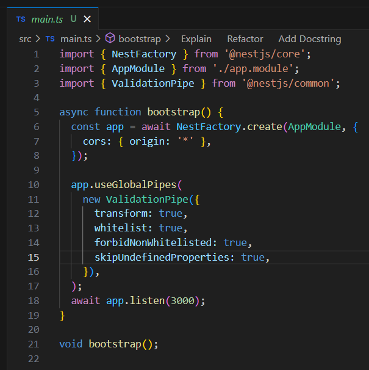

# DGPE Trainee 2: **Atividade 5 - TypeORM - API**

**_Desenvolvido por:_** _Thiago de Oliveira Miranda_.&nbsp;&nbsp;&nbsp;|&nbsp;&nbsp;&nbsp;[Github](https://github.com/ThiagoOMiranda)&nbsp;&nbsp;&nbsp;|&nbsp;&nbsp;&nbsp;[LinkedIn](https://www.linkedin.com/in/thiago-de-oliveira-miranda-5393181a7/)

_Repositório da atividade:_ [tarefa-5-typeorm-api](https://github.com/ThiagoOMiranda/trainee2/tree/feature/tarefa-5-typeorm-api).

<br>

### **Sumário:**

- <a href="#escopo">Escopo do Projeto</a>
- <a href="#complemento_1">Complemento 1: DTOs e Mapper</a>
- <a href="#complemento_2">Complemento 2: Validações</a>
- <a href="#estrutura">Estrutura do projeto</a>
- <a href="#projeto_apresentado">Projeto apresentado</a>
- <a href="#principios_arquiteturais">Princípios Arquiteturais</a>
- <a href="#principios_solid">Princípios SOLID</a>
- <a href="#convencoes_organizacao">Convenções de Organização</a>

<br>

### `Escopo do Projeto: CRUD completo utilizando o TypeORM` <a name="escopo"></a>

O projeto consiste em criar uma _API_ simples de tema livre utilizando _NestJS + TypeORM_, que realize as operações básicas de um CRUD (Create, Read, Update, Delete) e implementar a persistência dos dados em memória com SQLite. O projeto deve obrigatoriamente seguir a estrutura com entidade, repositório, serviço, controller e módulo.

**Deve ser implentado, no mínimo, as seguintes funcionalidades:**

- Criação (POST);
- Listagem Todos e por ID (GET);
- Atualização (PUT ou PATCH);
- Exclusão (DELETE);

### `Complemento 1: DTOs e Mapper` <a name="complemento_1"></a>

Criar os _DTOs_ considerando o modelo escolhido e avaliar e escolher uma solução entre _Mapper_ e _Adapter_.

### `Complemento 2: Validações` <a name="complemento_2"></a>

Adicione as validações necessárias no DTO da Atividade 5, respeitando o contexto e os requisitos de cada campo (por exemplo: título, descrição, IDs, etc.). As validações podem ser aplicadas globalmente no DTO ou localmente, caso prefira organizar de outra forma , ambas as abordagens são válidas.

<br>

### `Estrutura do projeto` <a name="estrutura"></a>

```
src/
├── game/
│   ├── dto/
│   │   ├── create-game.dto.ts
│   │   ├── game.dto.ts
│   │   └── update-game.dto.ts
│   ├── game.controller.ts
│   ├── game-genre.enum.ts
│   ├── game-platform.enum.ts
│   ├── game.entity.ts
│   ├── game.module.ts
│   ├── game.repository.ts
│   └── game.service.ts
├── mappers/
│   ├── base.mapper.ts
│   ├── game.mapper.ts
│   └── order.mapper.ts
├── order/
│   └── (*estrutura similar ao módulo -> game)
├── sqlite/
│   ├── gamestore.db.sqlite
│   └── sqlite.module.ts
├── transformers/
│   └── dayjs.transformer.ts
├── app.module.ts
└── main.ts

```

<br>

### `Projeto apresentado:` <a name="projeto_apresentado"></a>

**_Gamestore API:_** API simplificada para gerenciamento um _ecommerce_ de jogos. Para isto foi modelado para este projeto de fins educativos os modelos de Game e Order. Para o registro adequado em banco de dados foi implementado a relação entre as entidades Game e Order, ManyToMany.

**_Game Entity:_**

```
export class Game {
  id: string;

  title: string;

  price: number;

  description: string;

  publisher: string;

  genre: GameGenreEnum;

  platform: GamePlatformEnum[];

  release_date: Date;

  isActive: boolean;

  createdAt: Date;

  updatedAt: Date | null;

  orders: Order[];
}
```

<br>

**_Order Entity:_**

```
export class Order {
  id: string;

  customerName: string;

  customerEmail: string;

  customerPhone: string;

  games: Game[];

  totalPrice: number;

  orderStatus: OrderStatusEnum;

  createdAt: Date;

  updatedAt: Date | null;
}
```

<br>

**Implementação de Transformers para Timezone com DayJS:**
O projeto utiliza um transformer personalizado chamado DayJsTransformer para gerenciar corretamente as datas e timezones no banco de dados. Esta implementação garante que todas as datas sejam armazenadas e recuperadas no fuso horário de São Paulo (America/Sao_Paulo).

_Transformer:_

```
// src/transformers/dayjs.transformer.ts
import timezone from 'dayjs/plugin/timezone';
import { ValueTransformer } from 'typeorm';
import utc from 'dayjs/plugin/utc';
import dayjs from 'dayjs';

dayjs.extend(utc);
dayjs.extend(timezone);

dayjs.locale('pt-br');
dayjs.tz.setDefault('America/Sao_Paulo');

export class DayJsTransformer implements ValueTransformer {
  constructor(private readonly format: string = 'YYYY-MM-DD HH:MM') {}

  from(value: string | Date | null): Date | null {
    if (!value) return null;
    return dayjs.tz(value, this.format, 'America/Sao_Paulo').toDate();
  }

  to(value: Date | null): string | null {
    if (!value) return null;
    return dayjs.tz(value, 'America/Sao_Paulo').format(this.format);
  }
}

```

_Pontos importantes:_

- Define o timezone padrão como 'America/Sao_Paulo';
- Métodos de Transformação:

  - to(): Converte a data do formato JavaScript para string no formato especificado;
  - from(): Converte a string do banco de dados para um objeto Date do JavaScript;

<br>

- Uso nas Entidades:
  - Aplicado nas colunas de data como createdAt e updatedAt;
  - Garante consistência na formatação e timezone em toda a aplicação;

_Exemplo de Uso nas Entidades:_

```
// src/transformers/dayjs.transformer.ts
import timezone from 'dayjs/plugin/timezone';
import { ValueTransformer } from 'typeorm';
import utc from 'dayjs/plugin/utc';
import dayjs from 'dayjs';

dayjs.extend(utc);
dayjs.extend(timezone);

dayjs.locale('pt-br');
dayjs.tz.setDefault('America/Sao_Paulo');

export class DayJsTransformer implements ValueTransformer {
  constructor(private readonly format: string = 'YYYY-MM-DD HH:MM') {}

  from(value: string | Date | null): Date | null {
    if (!value) return null;
    return dayjs.tz(value, this.format, 'America/Sao_Paulo').toDate();
  }

  to(value: Date | null): string | null {
    if (!value) return null;
    return dayjs.tz(value, 'America/Sao_Paulo').format(this.format);
  }
}

```

<br>

**Criação e implementação Mappers para conversão entre entidades e DTOs:**
Os mappers são componentes essenciais na arquitetura do projeto, responsáveis por converter dados entre as entidades de domínio e os DTOs (Data Transfer Objects). Eles garantem uma separação clara entre a camada de domínio e a camada de apresentação.

_Implementação Base:_

O projeto implementa uma classe base abstrata que define o contrato para todos os mappers:

```
// src/mappers/base.mapper.ts
// base.mapper.ts
export abstract class BaseMapper<TEntity, TDto> {
  abstract toDto(entity: TEntity): TDto;
  abstract toEntity(dto: TDto): TEntity | Partial<TEntity>;

  toDtos(entities: TEntity[]): TDto[] {
    return entities.map(entity => this.toDto(entity));
  }

  toEntities(dtos: TDto[]): TEntity[] {
    return dtos.map(dto => this.toEntity(dto));
  }
}
```

<br>

_Implementação Específica: GameMapper_

```
// src/mappers/game.mapper.ts
export class GameMapper extends BaseMapper<Game, GameDto> {
  toDto(entity: Game): GameDto {
    return {
      // Executa a conversão de entidade para DTO;
      // Utiliza o mapeamento definido no GameDto;

      const dto = new GameDto();
      dto.id = entity.id;
      dto.title = entity.title;
      dto.price = entity.price;
      dto.description = entity.description;
      dto.genre = entity.genre;
      dto.publisher = entity.publisher;
      dto.platform = entity.platform;
      dto.release_date = entity.release_date;
      dto.isActive = entity.isActive;
    };
  }

  toEntity(dto: GameDto): Game {
    return {
      // Executa a conversão de DTO para entidade;
      // Utiliza o mapeamento definido no Game;

      const entity = new Game();
      if ('id' in dto && dto.id) entity.id = dto.id;
      entity.title = dto.title;
      entity.price = dto.price;
      entity.description = dto.description;
      entity.genre = dto.genre;
      entity.publisher = dto.publisher;
      entity.platform = dto.platform;
      if ('release_date' in dto) entity.release_date = dto.release_date;
      if ('isActive' in dto) entity.isActive = dto.isActive;
      return entity;
    };
  }
}
```
<br>

_Conversão em Métodos do Serviço:_

- _Injeção do Mapper no Serviço:_

```
@Injectable()
export class GameService {
  constructor(
    private readonly mapper: GameMapper,
    private readonly gameRepository: GameRepository,
  ) {}

``` 

<br>

- Aplicação específica:

```
// Convertendo DTO para Entidade
const entity = this.mapper.toEntity(createGameDto);
const createdEntity = await this.gameRepository.save(entity);

// Convertendo Entidade para DTO
return this.mapper.toDto(createdEntity);

``` 	

<br>

**_Implementação de Validações nos DTOs:_**
Foi implementada de forma global na _main.ts_ chamando o _useGlobalPipes()_ e instanciando o _ValidationPipe_ com as propriedades _whitelist_ e _forbidNonWhitelisted_, _transform_ e skipUndefinedProperties.

<p align="center"></p>

<p align="center"><i>Figura 01: Implementação Global do ValidationPipe.</i></p>

<br>

### `Princípios Arquiteturais` <a name="principios_arquiteturais"></a>

**_Arquitetura em Camadas (Layered Architecture):_** A Arquitetura em Camadas é um padrão arquitetural que organiza o código em camadas lógicas, onde cada camada tem responsabilidades bem definidas e se comunica apenas com as camadas adjacentes.

- Clara separação entre as camadas do sistema: controllers, services e repositórios;
  -Camada de Apresentação( controllers );
  -Camada de Negócio ( services );
  -Camada de Persistência ( repositories );

<br>

**_Design Modular (Modular Design):_** O Design Modular é um princípio arquitetural que divide um sistema em módulos independentes e coesos, onde cada módulo agrupa funcionalidades relacionadas e possui responsabilidades bem definidas.

- Organização baseada em funcionalidades ( Módulos:Game, Order);
- Cada módulo encapsula funcionalidades relacionadas;
- Utilização do sistema de módulos do NestJS para gerenciamento de dependências;

<br>

**_Padrão DTO (Data Transfer Object):_** O Padrão _DTO (Objeto de Transferência de Dados)_ é um padrão de projeto usado para transferir dados entre subsistemas de um aplicativo, como entre a camada de apresentação e a camada de serviço.

- Transferência de dados entre camadas do sistema;
- Implementação de mapeamento entre _entidades_ e _DTOs_;
- Desacopla o modelo de domínio da representação da API;

<br>

### `Princípios SOLID` <a name="principios_solid"></a>

**Princípio da Responsabilidade Única (SRP):** O Princípio da Responsabilidade Única (Single Responsibility Principle - SRP) é o primeiro dos cinco princípios SOLID. Ele estabelece que:

"Uma classe deve ter apenas um motivo para mudar, ou seja, deve ter apenas uma responsabilidade."

- Cada classe tem uma única responsabilidade;
- _Controladores_ lidam com _requisições HTTP_;
- _Serviços_ contêm a _lógica de negócios_;
- _Repositórios_ gerenciam o _acesso a dados_;

<br>

**Princípio Aberto/Fechado (OCP):**
O Princípio Aberto/Fechado (Open/Closed Principle - OCP) é o segundo princípio SOLID, que estabelece que:

"Entidades de software (classes, módulos, funções, etc.) devem estar abertas para extensão, mas fechadas para modificação."

- Alcançado através de _classes abstratas_ e _interfaces_;

<br>

**Princípio da Substituição de Liskov (LSP):**
O Princípio da Substituição de Liskov (Liskov Substitution Principle - LSP) é o terceiro princípio SOLID, que estabelece que:

"Objetos de uma superclasse devem ser substituíveis por objetos de suas subclasses sem afetar a correção do programa."

- Classes derivadas podem ser usadas em lugar de suas superclasses;
- Alcançado através da hierarquia aplicada nos _mappers_;

<br>

**Princípio da Inversão de Dependência (DIP):**
O Princípio da Inversão de Dependência (Dependency Inversion Principle - DIP) é o quarto princípio SOLID, que estabelece que:

"Dependências devem ser invertidas para que a classe dependa de abstrações, não de implementações."

- _GameService_ (alto nível) não cria diretamente instâncias de _GameMapper_ ou _GameRepository_ (baixo nível);
- Utilização do _NestJS_ para injeção de dependência;

<br>

### `Convenções de Organização` <a name="convencoes_organizacao"></a>

**Organização por Funcionalidade (Feature-First Organization):**
A Organização por Funcionalidade é uma abordagem de estruturação de código que agrupa todos os arquivos relacionados a uma mesma funcionalidade em um único diretório, em vez de organizá-los por tipo de arquivo.

- Organização por Funcionalidade;
- Cada funcionalidade contém seus próprios DTOs, entidades, serviços, etc.

```
src/
├── game/                    # Módulo de Jogos
│   ├── dto/                 # DTOs específicos de jogos
│   ├── entities/            # Entidades de domínio
│   ├── services/            # Lógica de negócios
│   ├── controllers/         # Controladores HTTP
│   └── game.module.ts       # Definição do módulo
│
└── order/                   # Módulo de Pedidos
    ├── dto/                 # DTOs específicos de pedidos
    ├── entities/            # Entidades de domínio
    ├── services/            # Lógica de negócios
    ├── controllers/         # Controladores HTTP
    └── order.module.ts      # Definição do módulo
```

<br>

**Nomenclatura Consistente de Arquivos:**
Padrão de nomenclatura que segue o formato: **_recurso.tipo.ts_**.

<br>

**Tipagem forte de Typescript:**
Uso consistente de tipos em toda a aplicação.
